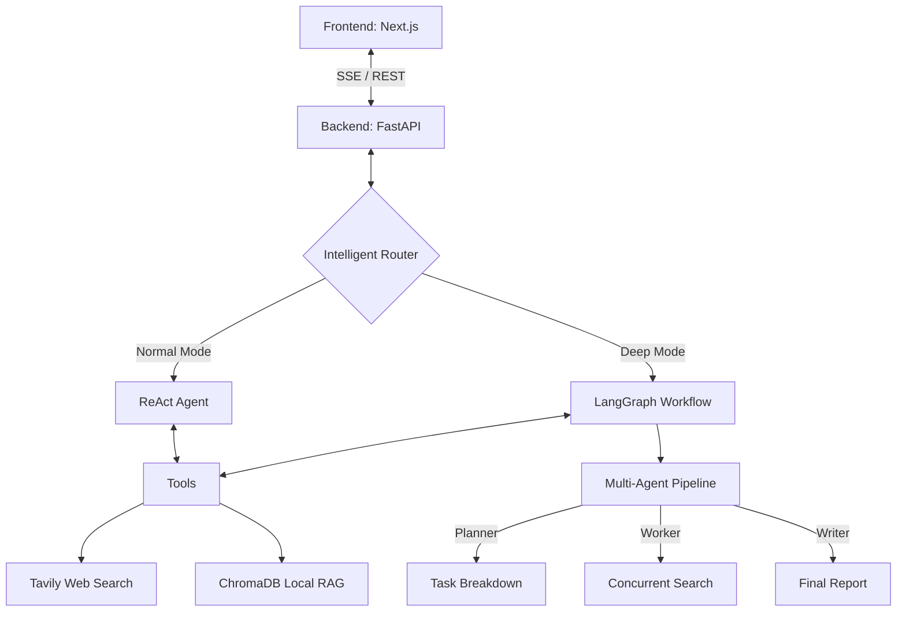

# 🚀 Mini Deep Research Agent

[](https://nextjs.org/)
[](https://www.python.org/)
[](https://fastapi.tiangolo.com/)
[](https://langchain-ai.github.io/langgraph/)
[](LICENSE)

> **A Hybrid RAG Dual-State Agent.** Seamlessly combining local private knowledge (ChromaDB) with global web intelligence (Tavily), powered by advanced LLMs (Qwen/OpenAI) and LangGraph orchestration.

---

## 🌟 Key Features

### 🎨 Modern Interaction
- **Geek-Style UI/UX**: A responsive, minimal interface built with **Next.js 15** and **Tailwind CSS 4**.
- **Dark/Light Mode**: Seamless theme switching for a premium native app feel.
- **Streaming Visualization**: Real-time SSE parsing with typewriter effects and dynamic reasoning trajectory rendering.

### 🧠 Intelligent Core
- **Dual-State Routing**: 
    - **Chat Mode**: Lightweight, second-level responses using local tools.
    - **Deep Research**: Heavy-duty multi-node pipeline (**Planner → Worker → Writer**) via LangGraph.
- **Hybrid Search**: Concurrent execution of **Tavily** (Web) and **ChromaDB** (Local) using `asyncio` for zero blocking.
- **Smart Citation**: Transparently distinguishes between `[Web]` and `[Private Library]` sources to eliminate hallucinations.

### 🛠️ Data & Engineering
- **One-Click Mounting**: Support for `.pdf`, `.txt`, `.md`, and `.docx` with real-time vectorization feedback.
- **MD5 Deduplication**: Content-addressable hashing to prevent redundant storage and save tokens.
- **Observability**: Decoupled logging system and **Anthropic-standard** automated Evals (`LLM-as-a-Judge`).

---

## 🏗️ Architecture



---

## 📂 Project Structure

```text
.
├── minideepResearch/       # 🎨 Frontend (Next.js 15 + Tailwind 4)
│   ├── src/components/     # UI Components (Chat, ThinkingProcess, etc.)
│   ├── src/app/api/        # Next.js API Routes (Proxying to Backend)
│   └── prisma/             # Local DB Schema for Chat History
├── ResearchAgent/          # ⚙️ Backend (Python + FastAPI + LangGraph)
│   ├── agents/             # Agent Logic (DeepGraph, ChatAgent)
│   ├── rag/                # RAG Engine (VectorStore, Memory)
│   ├── core/               # Shared Utilities (LLM, Logger, Config)
│   ├── cli.py              # Terminal Debugging Console
│   └── main.py             # FastAPI Server Entry
└── README.md               # You are here
```

---

## 🚀 Quick Start

### 1. Prerequisites
- **Python** 3.10+
- **Node.js** 18+ (pnpm/npm)

### 2. Backend Setup
```bash
cd ResearchAgent
pip install -r requirements.txt

# Configure Environment
cp .env.example .env # Or create manually
# Edit .env with your API keys (OPENAI_API_KEY, TAVILY_API_KEY)

# Start API
uvicorn main:app --reload
```

### 3. Frontend Setup
```bash
cd minideepResearch
npm install
npm run dev
```
Visit `http://localhost:3000` to start exploring!

---

## 🧪 Development Tools

### 🖥️ Terminal Console
Run a pure terminal-based agent for rapid debugging:
```bash
cd ResearchAgent
python cli.py
```
*Supports `/mode normal` and `/mode deep` commands.*

### 📊 Automated Evaluation
Run the `LLM-as-a-Judge` script to benchmark tool accuracy:
```bash
python evaluate.py
```

---

## 🛠️ Tech Stack

- **Frontend**: Next.js 15, React 19, Tailwind CSS 4, Zustand, Framer Motion, Ant Design.
- **Backend**: FastAPI, LangGraph, LangChain, Pydantic, SSE.
- **Storage**: ChromaDB (Vector), SQLite (Checkpoints), PostgreSQL/Prisma (History).
- **Search**: Tavily AI Search.

---

## 📄 License
Distributed under the MIT License. See `LICENSE` for more information.

---
<p align="center">
  Built with ❤️ for the AI community.
</p>
