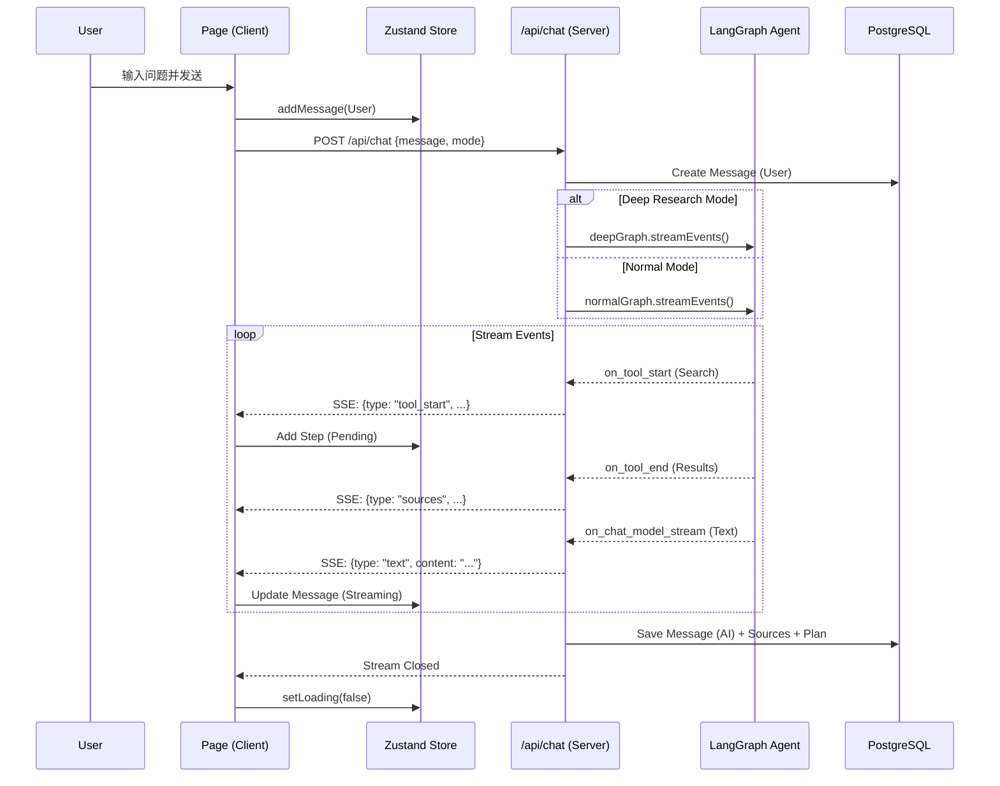

# 第二阶段：架构与路由设计 (Architecture & Routing)

本文档深入解析 `mini-deepresearch_replicate` 的系统骨架。项目采用了 **Next.js 16 App Router** 架构，结合 **Server Actions** 和 **React 19** 特性，实现了一个典型的 AI Agent 客户端。

## 1. 目录结构深度映射 (Directory Map)

项目遵循 Next.js 推荐的 Feature-based 结构，核心代码集中在 `src/` 下。

```text
src/
├── agents/              # [核心] AI 智能体逻辑 (LangGraph)
│   ├── graph.ts         # 普通问答图 (Normal Mode)
│   ├── deepGraph.ts     # 深度研究图 (Deep Mode)
│   └── tools.ts         # 工具定义 (Tavily Search 等)
├── app/                 # [路由] Next.js App Router
│   ├── api/             # 后端 API 路由
│   │   ├── chat/        # 核心流式对话接口
│   │   ├── history/     # 侧边栏历史记录 CRUD
│   │   └── share/       # 生成分享链接
│   ├── share/[id]/      # 分享页 (Server Component)
│   ├── layout.tsx       # 全局布局 (Toaster, Fonts)
│   └── page.tsx         # 主页 (Client Component, 核心交互)
├── components/          # [UI] 组件库
│   ├── Chat/            # 聊天相关 (气泡, 输入框, 思考过程)
│   ├── Sidebar/         # 侧边栏 (历史记录, 模式切换)
│   └── Layout/          # 通用布局组件
├── lib/                 # [工具] 通用函数
│   ├── prisma.ts        # Prisma 单例客户端
│   └── utils.ts         # Tailwind 合并等工具
└── store/               # [状态] Client State
    └── useChatStore.ts  # Zustand 全局状态 (消息流, UI状态)
```

## 2. 路由与页面分析 (Routes & Pages)

### 2.1 主页 (`/`) - `src/app/page.tsx`
*   **类型**: Client Component (`"use client"`).
*   **职责**:
    *   承载主要交互逻辑。
    *   利用 `useChatStore` 管理所有动态状态 (Input, Messages, Loading)。
    *   处理 SSE (Server-Sent Events) 流式响应解析。
*   **核心逻辑**:
    *   `handleSend`: 发起 POST 请求，通过 `Reader` 逐行读取流。
    *   **流解析器**: 手动解析 `data: {type: ..., content: ...}` 格式，分发处理 `text` (文本), `tool_start` (搜索开始), `plan_update` (计划更新) 等事件。

### 2.2 分享页 (`/share/[id]`) - `src/app/share/[id]/page.tsx`
*   **类型**: Server Component (`async`).
*   **职责**:
    *   SEO 友好，快速加载。
    *   从 DB 读取 `SharedChat` 快照。
    *   复用 `ChatMessage` 组件，但设置为 `isReadOnly` 模式。
*   **数据获取**: 直接在组件内 `await prisma.sharedChat.findUnique(...)`。

### 2.3 对话 API (`/api/chat`) - `src/app/api/chat/route.ts`
*   **类型**: Route Handler (Node.js runtime)。
*   **职责**:
    *   连接前端与 LangGraph 智能体。
    *   **双模式分流**: 根据 `mode` 参数决定调用 `normalGraph` 还是 `deepGraph`。
    *   **事件转换**: 监听 LangGraph 的 `streamEvents`，将其转换为前端可读的 SSE 格式。
    *   **持久化**: 在流结束后，将完整对话、来源 (Sources) 和计划 (Plan) 存入 Postgres。

## 3. 数据流向架构图 (Data Flow)

以下 Mermaid 图表展示了用户发送消息后的完整数据流转：



## 4. 关键架构设计点

1.  **流式协议 (Streaming Protocol)**:
    *   前后端未采用标准的 Vercel AI SDK `useChat`，而是自定义了一套基于 SSE 的简单协议。
    *   协议格式: `data: JSON.stringify({ type: string, content: any })\n\n`.
    *   优势: 极其灵活，可以随意推送 `plan_update`, `chat_id`, `sources` 等自定义事件，不受 SDK 限制。

2.  **状态管理分层**:
    *   **服务端**: 无状态 (Stateless) 的 HTTP 请求，但在 LangGraph 运行期间持有内存状态 (`GraphState`)。持久化依赖 DB。
    *   **客户端**: Zustand 单一数据源，负责将破碎的流式片段“缝合”成完整的 UI 状态。

3.  **递归 JSON 修复**:
    *   在前端处理 `tool_start` 时，实现了一个 `extractCleanQuery` 递归函数。这是为了应对 LLM 经常输出嵌套 JSON (如 `{"input": "{\"query\": ...}"}`) 的情况，增强了系统的鲁棒性。

