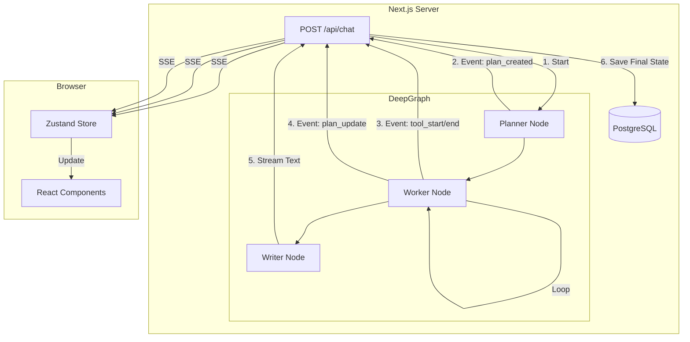

# 第三阶段：核心业务逻辑 (The Brain)

本文档深入剖析 `mini-deepresearch_replicate` 的智能核心，涵盖 **AI 编排**、**状态管理** 与 **持久化** 三大支柱。

## 1. AI 编排 (The Agents) - LangGraph 实战

项目使用了 LangGraph (LangChain 的图编排扩展) 来定义 AI 的思考流程。核心逻辑位于 `src/agents/`。

### 1.1 普通模式 (`graph.ts`)
*   **架构**: 经典的 ReAct (Reason + Act) 循环。
*   **状态**: `AgentState` (仅包含 messages 数组)。
*   **节点**:
    *   `agent`: 调用 LLM (Bind Tools)。LLM 决定是直接回复还是调用工具。
    *   `tools`: 执行工具 (Tavily Search)。
*   **流程**:
    `START` -> `agent` -> (检测 tool_calls) -> `tools` -> `agent` -> ... -> `END`

### 1.2 深度研究模式 (`deepGraph.ts`)
*   **架构**: Plan-and-Solve (规划-执行-总结) 模式，一种简单的 Multi-Agent 协作。
*   **状态 (`DeepResearchState`)**:
    *   `plan`: 任务清单 (Array<{ task, status }>)。
    *   `gathered_info`: 收集到的所有搜索结果摘要。
    *   `iteration_count`: 防止死循环的计数器。
*   **核心节点**:
    1.  **Planner (规划师)**:
        *   使用 `withStructuredOutput` (Zod Schema) 强制 LLM 输出 JSON 格式的任务列表。
        *   Prompt: "将目标拆解为 3-5 个具体的子任务..."
    2.  **Worker (执行者)**:
        *   找到第一个 `pending` 的任务。
        *   调用 `searchWebTool` 获取信息。
        *   将搜索结果追加到 `gathered_info`，并将该任务标记为 `done`。
    3.  **Writer (作家)**:
        *   当所有任务完成 (或达到最大迭代次数) 时触发。
        *   基于 `gathered_info` 撰写最终的长篇 Markdown 报告。
*   **循环逻辑**:
    `Planner` -> `Worker` -> (check pending) -> `Worker` -> ... -> `Writer` -> `END`

### 1.3 工具层 (`tools.ts`)
*   **Search Tool**: 封装了 `TavilySearchAPIRetriever`。
*   **关键优化**: 重写了输出格式。
    ```text
    [结果 1]
    标题: ...
    来源: ...
    内容摘要: ...
    ---
    ```
    这种显式的分割线格式大大降低了 LLM 产生幻觉的概率，同时也便于后端正则解析。

## 2. 状态管理 (The State) - Zustand

`src/store/useChatStore.ts` 是前端的“单一数据源”，它不仅仅管理 UI 状态，还负责了复杂的**流式数据重组**。

*   **核心设计模式**: `Action` 驱动的状态更新。
*   **关键数据结构**:
    ```typescript
    interface Message {
        id: string;
        content: string; // 实时流式更新的文本
        steps?: Step[];  // 深度模式下的思考步骤 (搜索中...)
        sources?: Source[]; // 引用来源列表
        plan?: PlanItem[];  // 任务清单 (实时打钩)
    }
    ```
*   **流式处理逻辑**:
    *   后端推送 `plan_update` 事件 -> Store 更新 `plan` -> UI 上的任务列表实时打钩。
    *   后端推送 `tool_start` 事件 -> Store 添加一个 `pending` 的 Step -> UI 显示 "正在搜索..."。
    *   后端推送 `text` 事件 -> Store 累加 `content` -> UI 显示打字机效果。

## 3. 持久化层 (Persistence) - Prisma & Postgres

数据模型 (`prisma/schema.prisma`) 设计精简但功能完备。

*   **Schema 设计**:
    *   `Chat`: 会话容器。
    *   `Message`: 核心载体。
        *   `sources Json?`: 利用 Postgres 的 JSONB 类型直接存储来源数组，无需关联表，读写高效。
        *   `plan Json?`: 同上，存储任务清单快照，保证刷新页面后任务进度不丢失。
    *   `SharedChat`: 独立的分享表，存储的是某一时刻的 Message **副本** (Snapshot)，保证原对话更新不影响已生成的分享链接。

## 4. 核心逻辑总结图


